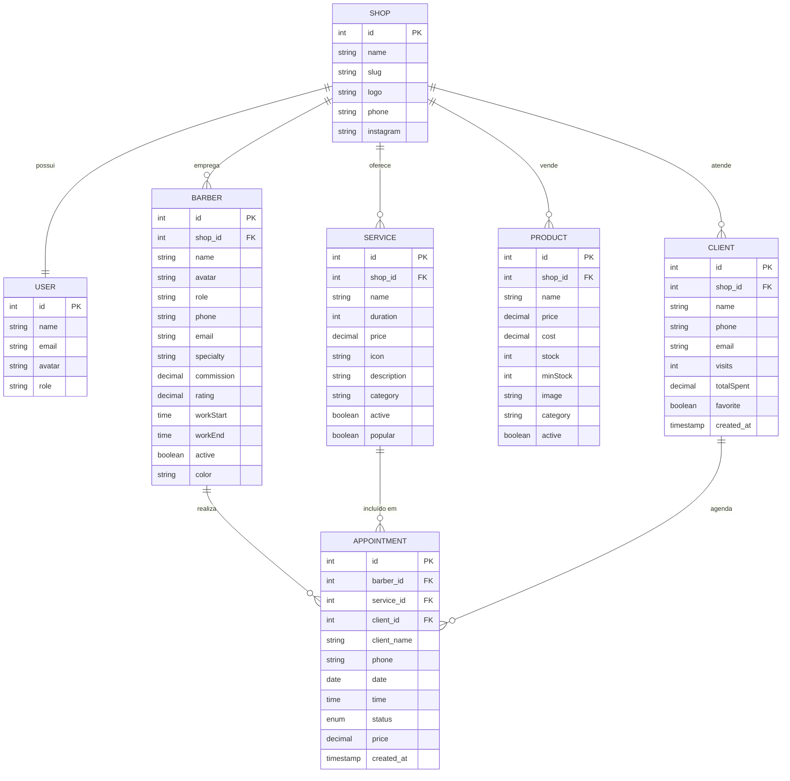

# Diagrama de Entidade-Relacionamento - BarberFlow

Sistema de agendamento e gestão para barbearias.

---

## Visão Geral das Entidades

```
┌─────────────────────────────────────────────────────────────────────────────────────────────────────────┐
│                                    DIAGRAMA ENTIDADE-RELACIONAMENTO                                      │
│                                           BarberFlow System                                              │
└─────────────────────────────────────────────────────────────────────────────────────────────────────────┘

    ┌──────────────────────┐                           ┌──────────────────────┐
    │        USER          │                           │        SHOP          │
    ├──────────────────────┤                           ├──────────────────────┤
    │ PK id                │                           │ PK id                │
    │    name        VARCHAR│        1           1     │    name        VARCHAR│
    │    email       VARCHAR│◄────────────────────────►│    slug        VARCHAR│
    │    avatar      VARCHAR│                           │    logo        VARCHAR│
    │    role        VARCHAR│                           │    phone       VARCHAR│
    └──────────────────────┘                           │    instagram   VARCHAR│
                                                       └──────────────────────┘
                                                                 │
                         ┌───────────────────────────────────────┼───────────────────────────────────────┐
                         │                                       │                                       │
                         │ 1                                   1 │                                     1 │
                         ▼                                       ▼                                       ▼
                         N                                       N                                       N
    ┌──────────────────────┐           ┌──────────────────────┐           ┌──────────────────────┐
    │       BARBER         │           │       SERVICE        │           │       PRODUCT        │
    │      (Team)          │           ├──────────────────────┤           ├──────────────────────┤
    ├──────────────────────┤           │ PK id                │           │ PK id                │
    │ PK id                │           │ FK shop_id           │           │ FK shop_id           │
    │ FK shop_id           │           │    name        VARCHAR│           │    name        VARCHAR│
    │    name        VARCHAR│           │    duration    INT   │           │    price       DECIMAL│
    │    avatar      VARCHAR│           │    price       DECIMAL│           │    cost        DECIMAL│
    │    role        VARCHAR│           │    icon        VARCHAR│           │    stock       INT    │
    │    phone       VARCHAR│           │    description VARCHAR│           │    minStock    INT    │
    │    email       VARCHAR│           │    category    VARCHAR│           │    image       VARCHAR│
    │    specialty   VARCHAR│           │    active      BOOLEAN│           │    category    VARCHAR│
    │    commission  DECIMAL│           │    popular     BOOLEAN│           │    active      BOOLEAN│
    │    rating      DECIMAL│           └──────────────────────┘           └──────────────────────┘
    │    workStart   TIME   │                      │
    │    workEnd     TIME   │                      │ 1
    │    active      BOOLEAN│                      │
    │    color       VARCHAR│                      │
    └──────────────────────┘                      │
              │                                    │
              │ 1                                  │
              │                                    │
              │                                    │
              ▼                                    ▼
              N                                    N
    ┌────────────────────────────────────────────────────────┐
    │                      APPOINTMENT                        │
    ├────────────────────────────────────────────────────────┤
    │ PK id                                                  │
    │ FK barber_id                                           │
    │ FK service_id                                          │
    │ FK client_id                                           │
    │    client_name     VARCHAR  (desnormalizado)           │
    │    phone           VARCHAR                             │
    │    date            DATE                                │
    │    time            TIME                                │
    │    status          ENUM (pending,confirmed,            │
    │                          completed,cancelled)          │
    │    price           DECIMAL                             │
    │    created_at      TIMESTAMP                           │
    └────────────────────────────────────────────────────────┘
              ▲
              │ N
              │
              │ 1
              │
    ┌──────────────────────┐
    │       CLIENT         │
    ├──────────────────────┤
    │ PK id                │
    │ FK shop_id           │
    │    name        VARCHAR│
    │    phone       VARCHAR│
    │    email       VARCHAR│
    │    visits      INT    │
    │    totalSpent  DECIMAL│
    │    favorite    BOOLEAN│
    │    created_at  TIMESTAMP│
    └──────────────────────┘
```

---

## Descrição das Entidades

| Entidade | Descrição | Atributos Principais |
|----------|-----------|---------------------|
| **User** | Usuário administrador do sistema | id, name, email, avatar, role |
| **Shop** | Barbearia cadastrada no sistema | id, name, slug, logo, phone |
| **Barber** | Membro da equipe (barbeiro) | id, name, specialty, commission, rating, horários |
| **Service** | Serviços oferecidos | id, name, duration, price, category, popular |
| **Product** | Produtos para venda | id, name, price, cost, stock, category |
| **Client** | Clientes da barbearia | id, name, phone, visits, totalSpent |
| **Appointment** | Agendamentos realizados | id, barber_id, service_id, client_id, date, time, status |

---

## Relacionamentos

| Relacionamento | Cardinalidade | Descrição |
|----------------|---------------|-----------|
| Shop → User | 1:1 | Uma barbearia possui um administrador |
| Shop → Barber | 1:N | Uma barbearia possui vários barbeiros |
| Shop → Service | 1:N | Uma barbearia oferece vários serviços |
| Shop → Product | 1:N | Uma barbearia tem vários produtos |
| Shop → Client | 1:N | Uma barbearia tem vários clientes |
| Barber → Appointment | 1:N | Um barbeiro realiza vários atendimentos |
| Service → Appointment | 1:N | Um serviço está em vários agendamentos |
| Client → Appointment | 1:N | Um cliente pode ter vários agendamentos |

---

## Diagrama Mermaid

Copie o código abaixo e visualize em [Mermaid Live Editor](https://mermaid.live/):



---

## Detalhamento dos Atributos

### USER (Usuário)
| Campo | Tipo | Descrição |
|-------|------|-----------|
| id | INT | Chave primária |
| name | VARCHAR(100) | Nome completo |
| email | VARCHAR(150) | Email único |
| avatar | VARCHAR(10) | Emoji ou URL do avatar |
| role | VARCHAR(20) | Função (admin, manager) |

### SHOP (Barbearia)
| Campo | Tipo | Descrição |
|-------|------|-----------|
| id | INT | Chave primária |
| name | VARCHAR(100) | Nome da barbearia |
| slug | VARCHAR(50) | URL amigável (único) |
| logo | VARCHAR(10) | Emoji ou URL do logo |
| phone | VARCHAR(20) | Telefone de contato |
| instagram | VARCHAR(50) | Handle do Instagram |

### BARBER (Barbeiro)
| Campo | Tipo | Descrição |
|-------|------|-----------|
| id | INT | Chave primária |
| shop_id | INT | FK para Shop |
| name | VARCHAR(100) | Nome completo |
| avatar | VARCHAR(10) | Emoji ou URL |
| role | VARCHAR(20) | admin / barber |
| phone | VARCHAR(20) | Telefone |
| email | VARCHAR(150) | Email |
| specialty | VARCHAR(100) | Especialidade |
| commission | DECIMAL(5,2) | % de comissão |
| rating | DECIMAL(2,1) | Avaliação média (0-5) |
| workStart | TIME | Início do expediente |
| workEnd | TIME | Fim do expediente |
| active | BOOLEAN | Ativo/Inativo |
| color | VARCHAR(50) | Cor do gradiente CSS |

### SERVICE (Serviço)
| Campo | Tipo | Descrição |
|-------|------|-----------|
| id | INT | Chave primária |
| shop_id | INT | FK para Shop |
| name | VARCHAR(100) | Nome do serviço |
| duration | INT | Duração em minutos |
| price | DECIMAL(10,2) | Preço em R$ |
| icon | VARCHAR(10) | Emoji do ícone |
| description | VARCHAR(255) | Descrição curta |
| category | VARCHAR(50) | corte/barba/combo/extras/tratamento |
| active | BOOLEAN | Ativo/Inativo |
| popular | BOOLEAN | Destaque como popular |

### PRODUCT (Produto)
| Campo | Tipo | Descrição |
|-------|------|-----------|
| id | INT | Chave primária |
| shop_id | INT | FK para Shop |
| name | VARCHAR(100) | Nome do produto |
| price | DECIMAL(10,2) | Preço de venda |
| cost | DECIMAL(10,2) | Custo de aquisição |
| stock | INT | Quantidade em estoque |
| minStock | INT | Estoque mínimo (alerta) |
| image | VARCHAR(10) | Emoji ou URL |
| category | VARCHAR(50) | Categoria do produto |
| active | BOOLEAN | Ativo/Inativo |

### CLIENT (Cliente)
| Campo | Tipo | Descrição |
|-------|------|-----------|
| id | INT | Chave primária |
| shop_id | INT | FK para Shop |
| name | VARCHAR(100) | Nome completo |
| phone | VARCHAR(20) | Telefone/WhatsApp |
| email | VARCHAR(150) | Email (opcional) |
| visits | INT | Total de visitas |
| totalSpent | DECIMAL(10,2) | Total gasto em R$ |
| favorite | BOOLEAN | Cliente favorito |
| created_at | TIMESTAMP | Data de cadastro |

### APPOINTMENT (Agendamento)
| Campo | Tipo | Descrição |
|-------|------|-----------|
| id | INT | Chave primária |
| barber_id | INT | FK para Barber |
| service_id | INT | FK para Service |
| client_id | INT | FK para Client (opcional) |
| client_name | VARCHAR(100) | Nome do cliente (desnormalizado) |
| phone | VARCHAR(20) | Telefone do cliente |
| date | DATE | Data do agendamento |
| time | TIME | Horário do agendamento |
| status | ENUM | pending/confirmed/completed/cancelled |
| price | DECIMAL(10,2) | Valor do serviço |
| created_at | TIMESTAMP | Data de criação |

---

## Status do Agendamento

| Status | Descrição |
|--------|-----------|
| `pending` | Aguardando confirmação |
| `confirmed` | Confirmado pelo barbeiro |
| `completed` | Atendimento concluído |
| `cancelled` | Cancelado |
